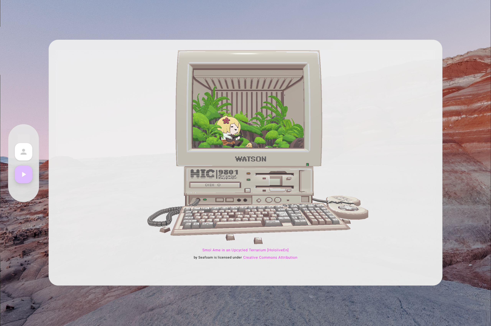

# Zenith for Android
This project is inspired by the visionOS app [Zenith](https://github.com/AkkeyLab/zenith), reimagined for Android XR.
It explores how similar spatial interactions can be built using Jetpack XR SDK.

## 💻 Requirements
- macOS running on Apple Silicon
- Android Studio Narwhal Feature Drop | 2025.1.2 Canary 6

## ⚠️ glTF & Licensing Notes
- All 3D assets used in this project are under Creative Commons Attribution 4.0:
    - [3D Anime Character girl for Blender C1](https://skfb.ly/oyACQ) by CGCOOL
    - [Shibahu](https://skfb.ly/ovSrM) by 腱鞘炎の人
    - Proper attribution is required if you use these assets elsewhere.

## 🪪 License
This project is licensed under the [MIT License](LICENSE).
You are free to use, modify, and distribute it with attribution.
